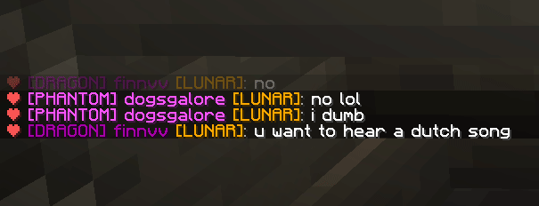

# CompactChat for Fabric

CompactChat is a mod which will clean up your minecraft chat.

If a message is sent twice, the previous message will be removed, and the newer one will have the number of occurrences appended to it.

*By default, CompactChat will automatically set your chat history's length to be infinite. This can be disabled via a config screen which can be opened with ModMenu.*

## Download

Get the latest download from the [releases page](https://github.com/cbyrneee/CompactChat/releases).

## License

CompactChat uses the [MIT](https://choosealicense.com/licenses/mit/) license
