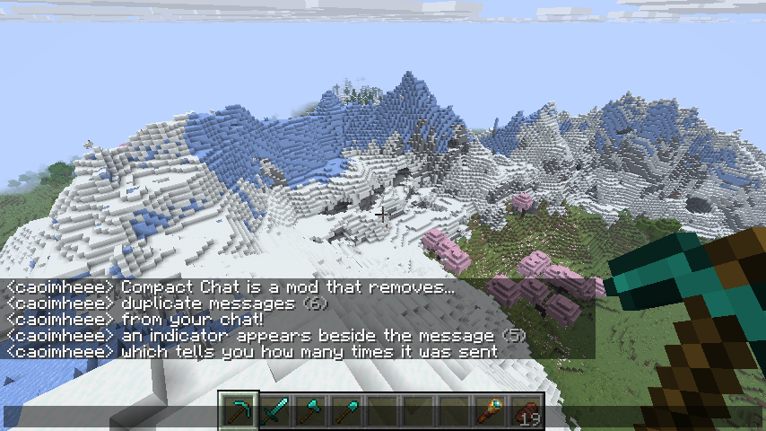

<h1>
💬 <code>compact-chat</code>

    
    
    

</h1>

Compact Chat is a Minecraft mod that removes duplicate messages from your chat.

Minecraft versions 1.21.1 and higher are supported on both Fabric and NeoForge. Older Minecraft versions may be
supported in the future if there is demand for them! (no, there will not be a Forge
port)</sb>

This project uses to [ReplayMod/preprocessor](https://github.com/ReplayMod/preprocessor/) to support multiple Minecraft
versions and [EssentialGG/essential-gradle-toolkit](https://github.com/essentialgg/essential-gradle-toolkit) to make it
all easier to set up.

## License

This project is licensed under the [MIT](./LICENSE) license.
